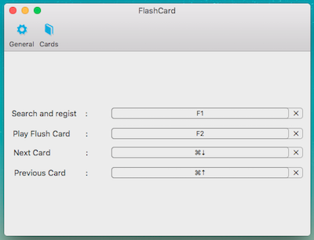
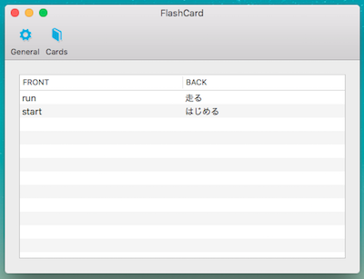
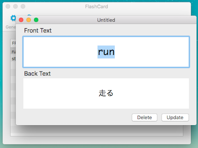

# FlashCard

## これはなに

macOS 用単語帳アプリ．

## Motivation

単語帳を作ろうとしたら以下の問題に直面した．

- 検索 -> 登録の作業が面倒だった
- シンプルな単語帳アプリが見つからなかった

なので，単語を検索しつつ登録が行えるアプリを作った．

## **注意**

検索に `辞書.app` を使用しているが，検索結果として plain text しかとってこれない．ある程度整形しているが，ところどころ見づらい．

## つかいかた

### メニュー

メニューバーのアイコンを押下するとメニューが現れる．
`Preferences` は設定画面を開く．
`Quit` はアプリを終了する．

### 設定画面

#### ホットキー設定

|Hotkey|役割|
|---|---|
|Search and regist|単語の検索&登録画面を表示する|
|Play Flush Card|単語帳を表示する|
|Next Card|単語帳を次にめくる|
|Previous Card|単語帳を前にめくる|

#### 単語帳編集

テーブルの各行を選択すると，単語カードを編集できる．

### 単語検索&登録画面

1. `Search and regist` キーを押下して画面表示
2. 単語を入力&検索し，目的の単語が表示されたら `Enter`
3. 単語帳の登録項目を埋めて `Enter`
   - `Front Text` : 表
   - `Back Text` : 裏

### 単語帳画面

`Play Flash Card` キーを押して表示し，`Next Card`，`Previous Card` キーでめくる．

## License

MIT © [tasuwo](https://github.com/tasuwo)
